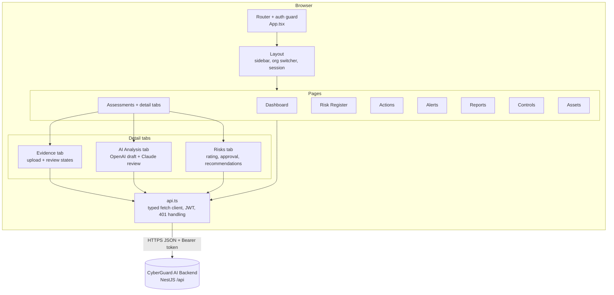

# CyberGuard AI — Frontend UI

**AI-assisted cybersecurity risk analysis, recommendation and alert platform for enterprises.**

This is the React frontend for CyberGuard AI, the dissertation prototype described in
*"CyberGuard AI: Design and Evaluation of an AI Assisted Cybersecurity Risk Analysis, Recommendation and Alert Platform for Enterprises."*
It provides organisational profiling, evidence review, AI-assisted analysis, a transparent
risk workbench, treatment tracking, alerts and reporting.

Backend repository: **CyberGuard-AI-Backend-API** (NestJS + PostgreSQL).

---

## Tech stack

| Layer | Technology |
|---|---|
| Framework | React 18 + TypeScript |
| Build tool | Vite 5 |
| Routing | react-router-dom v6 |
| HTTP | Native `fetch` with a typed API client (`src/api.ts`) |
| Styling | Hand-written CSS design system (`src/styles.css`) — no UI library |
| Auth | JWT stored client-side, attached as `Authorization: Bearer` |
| Hosting | Render static site |

## Application architecture



## User workflow

```mermaid
flowchart LR
    A[Register / Login] --> B[Create organisation]
    B --> C[Register assets<br/>criticality 1-5]
    C --> D[Create assessment]
    D --> E[Upload evidence<br/>PDF / DOCX / CSV / TXT]
    E --> F[Run OpenAI analysis<br/>draft claims + risk suggestions]
    F --> G[Request Claude review<br/>claim-by-claim critique]
    G --> H[Create + rate risks<br/>score computed server-side]
    H --> I[Approve versions<br/>immutable record]
    I --> J[Recommend catalogue controls]
    J --> K[Create + verify actions]
    K --> L[Evaluate alerts]
    L --> M[Generate report snapshot]
```



## Pages

| Route | Page | What it does |
|---|---|---|
| `/login` | Login / Register | Account creation and JWT sign-in |
| `/organisations` | Organisations | Create and select an organisation workspace |
| `/` | Dashboard | Stat cards, 5×5 risk matrix, priority action queue, recent alerts, one-click alert evaluation |
| `/assets` | Assets | Asset register with criticality ratings |
| `/assessments` | Assessments | List and create assessments |
| `/assessments/:id` | Assessment detail | Three tabs: **Evidence** (upload, extraction status, review states), **AI Analysis** (OpenAI draft claims/suggestions/questions, "Add as risk", Claude critique with verdicts and change log, run history), **Risks** (rating form with dissertation anchor labels, live score/band preview, approval, control recommendations) |
| `/risk-register` | Risk Register | All organisation risks with latest version bands, filterable |
| `/actions` | Actions | Treatment actions with submit-for-review / verify / return lifecycle |
| `/alerts` | Alerts | Severity-coded alerts with acknowledge + evaluate |
| `/reports` | Reports | Generate and inspect frozen report snapshots |
| `/controls` | Controls | Read-only curated control catalogue (NIST CSF 2.0 / ISO 27002 references) |

## Design system

Dark navy sidebar (`#16324a`), light content surface (`#f4f7fa`), white cards, teal accent
(`#0f766e`) and four severity colours matching the dissertation's risk matrix convention:

| Band | Score range | Colour |
|---|---|---|
| Low | 1–4 | green |
| Medium | 5–9 | yellow |
| High | 10–16 | orange |
| Critical | 17–25 | red |

The client shows a live score/band **preview** when rating a risk, but the authoritative score
and band are always recalculated by the backend before saving.

## Running locally

```bash
npm install
cp .env.example .env    # set VITE_API_URL if the backend is not on localhost:3000
npm run dev             # http://localhost:5173
```

### Environment variables

| Variable | Description |
|---|---|
| `VITE_API_URL` | Backend API base URL, e.g. `http://localhost:3000/api` or `https://<backend>.onrender.com/api` |

## Building

```bash
npm run build           # outputs static site to dist/
npm run preview
```

## Deploying to Render (static site)

1. Create a **Static Site** from this repository.
2. Build command: `npm install && npm run build`
3. Publish directory: `dist`
4. Environment variable: `VITE_API_URL=https://<your-backend>.onrender.com/api`
5. Add a rewrite rule so client-side routing works: `/*` → `/index.html` (action: *Rewrite*).

A ready-made blueprint is included in [`render.yaml`](render.yaml).

## Project structure

```
frontend/
├── index.html
├── vite.config.ts
├── src/
│   ├── main.tsx / App.tsx     # bootstrap, router, auth guard
│   ├── api.ts                 # typed fetch client (JWT, uploads, 401 handling)
│   ├── types.ts               # API models + risk band helpers + rating anchors
│   ├── styles.css             # design system
│   ├── components/            # Layout, RiskMatrix, badges, modal, tab components
│   └── pages/                 # one file per route (12 pages)
└── package.json
```
